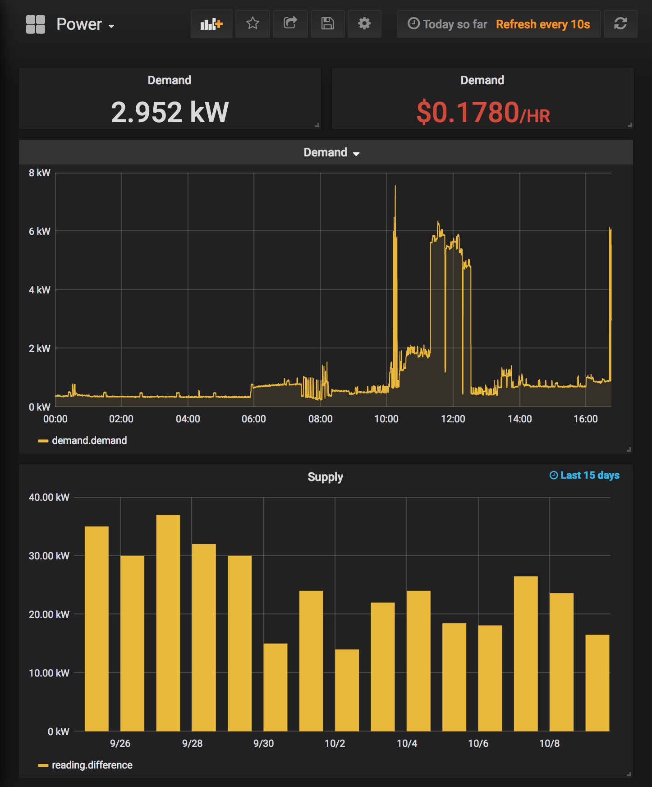

`emu2influx` uses Rainforest Automation's [Emu-Serial-API](https://github.com/rainforestautomation/Emu-Serial-API) to insert EMU-2 ([Amazon.com](https://www.amazon.com/Rainforest-EMU-2-Energy-Monitoring-Unit/dp/B00BGDPRAI)) energy monitoring data into InfluxDB

Images are available on Docker Hub for `armhf` and `amd64` at [bakerba/emu2influx](https://hub.docker.com/r/bakerba/emu2influx)

Your EMU-2 must be provisioned with your utility company and connected to your PC

<p align="center">
  
</p>

### Docker

` $ docker run --device=/dev/ttyACM0 bakerba/emu2influx --host <influx_ip> ttyACM0`

Example usage in `docker-compose.yml`

```
version: '3.3'

services:
  emu2influx:
    image: bakerba/emu2influx
    container_name: emu2influx
    network_mode: host
    devices:
      - /dev/ttyACM0:/dev/ttyACM0
    restart: unless-stopped
    command: '--host <influx_ip> ttyACM0'
```

### Prerequisites

* macOS with [Homebrew](https://brew.sh): 
```
$ brew install python2 influxdb
$ brew services start influxdb
```
* Debian/Ubuntu: 
```
sudo apt install python-pip libxslt1-dev influxdb
```

### Setup

```
$ git clone --recursive https://github.com/abaker/emu2influx.git
$ cd emu2influx
$ pip install -r requirements.txt 
```

### Run

`$ python emu2influx.py <emu2_serial_port>`

By default `emu2influx` will connect to a local InfluxDB install, use the default credentials, and store data in a table named `rainforest`

```
usage: emu2influx.py [-h] [--debug] [--host HOST] [--port PORT]
                     [--username USERNAME] [--password PASSWORD] [--db DB]
                     [--retries RETRIES]
                     serial_port

positional arguments:
  serial_port          Rainforest serial port, e.g. 'ttyACM0'

optional arguments:
  -h, --help           show this help message and exit
  --debug              enable debug logging
  --host HOST          influx host
  --port PORT          influx port
  --username USERNAME  influx username
  --password PASSWORD  influx password
  --db DB              influx database name
  --retries RETRIES    influx retries
``` 

### What next?

* Import the [sample dashboard](grafana.json) into Grafana (pictured above)
* Set up a Home Assistant [InfluxDB sensor](https://www.home-assistant.io/components/sensor.influxdb/)
